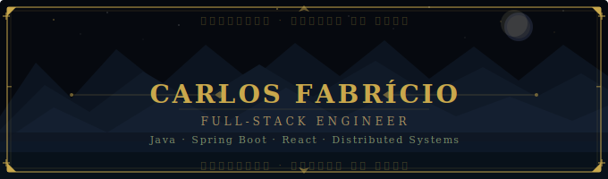

# Carlos Fabrício · Full-Stack Engineer
 
> Java · Spring Boot · React · NextJS · Distributed Systems · building in public
 
[](https://linkedin.com/in/fabricio-dev)
[](mailto:fabriciocls2001@gmail.com)
 
---
 
Full-stack engineer at Dataprev — Brazil's federal technology company for social security. I build and maintain systems that process benefit payments for tens of millions of citizens, where reliability isn't optional.
 
5 years across the stack: REST APIs and services in Java/Spring Boot at production scale, React interfaces for complex domain workflows, and legacy system evolution without disrupting live operations.
 
Currently deepening distributed systems, system design, and cloud-native architecture — and documenting the journey publicly.
 
---
 
## Skills
 
| | |
|---|---|
| **Backend** | Java 21, Spring Boot 3, Spring Security, JPA/Hibernate, Oracle, PostgreSQL |
| **Frontend** | React, TypeScript, NextJS, Vue 3, Tailwind CSS, React Query |
| **Infra** | Docker, GitHub Actions, Railway, Vercel |
| **Test** | JUnit 5, Mockito, Testcontainers |
| **Concepts** | REST APIs, RBAC, JWT, Distributed Systems, Clean Architecture |
 
---
 
## Projects
 
### [Auth & Authorization System](https://github.com/fabriciocls2001/auth-system)
Production-ready authentication API — JWT with refresh token rotation, Redis-based blacklisting, granular RBAC, rate limiting, audit log via Spring AOP, integration tests with Testcontainers.
 
`Java 21` `Spring Boot 3` `Spring Security` `Redis` `PostgreSQL` `Testcontainers` `Docker` `GitHub Actions`
 
[](#)
[](#)
 
---
 
## Currently
 
```
▸ Building a production-grade portfolio
▸ Reading: System Design Interview 
▸ Next
```
 
---
 
## Stats
 


 
---
 
<sub>João Pessoa, Brasil.</sub>
 
